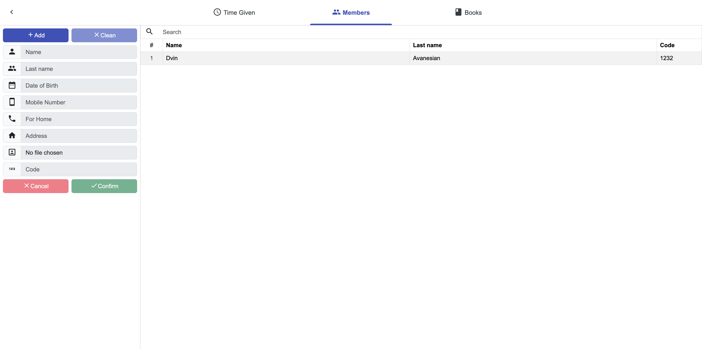
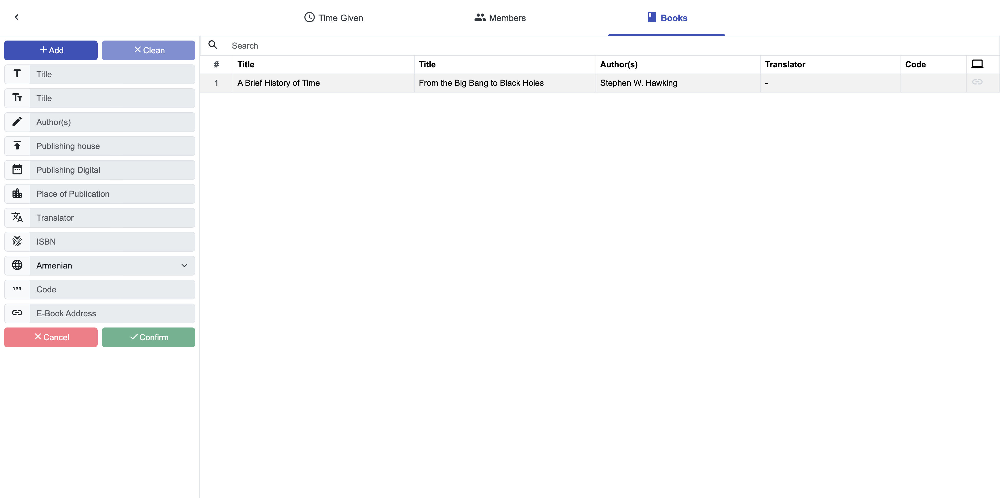
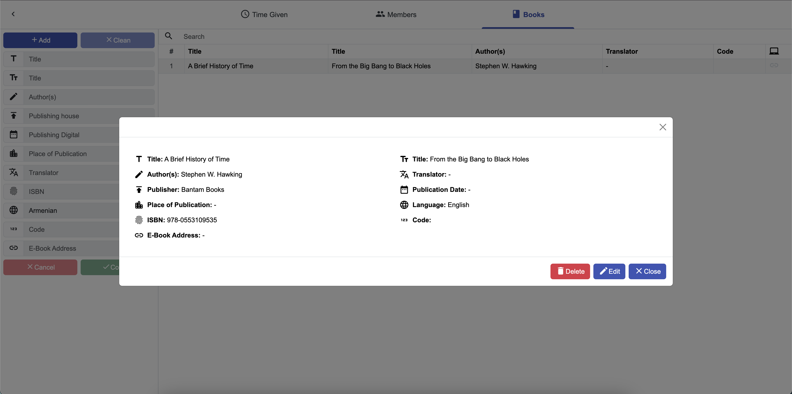
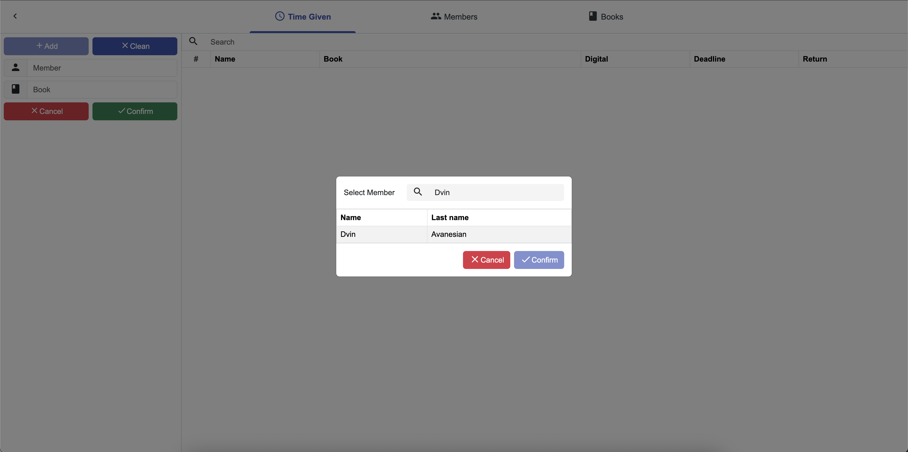
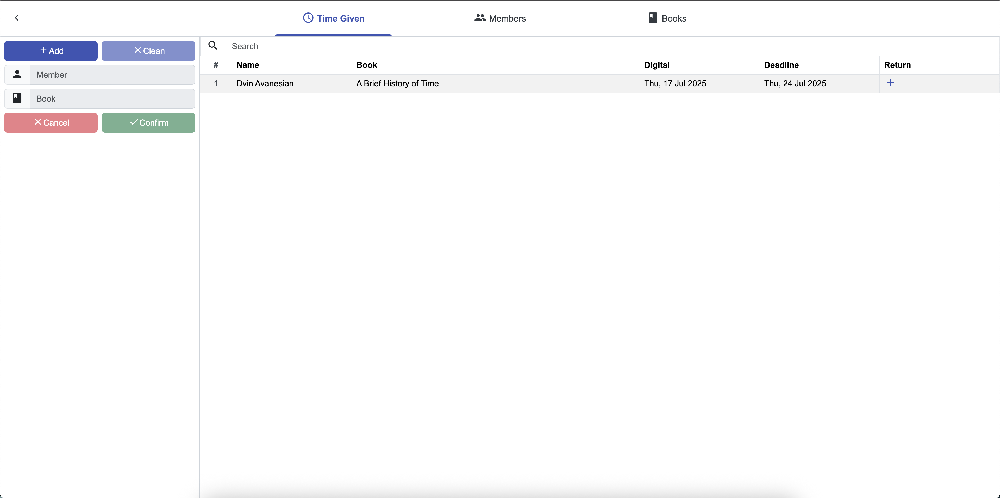
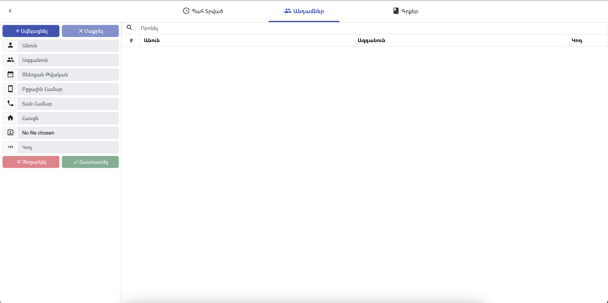

# Nalbandian Library Management Software

This is a library management software developed for the [Nalbandian Armenian Library](https://www.wikiwand.com/en/articles/Mikayel_Nalbandian) located in [New Julfa, Esfahan, Iran](https://www.wikiwand.com/en/articles/New_Julfa). The application is designed to manage library operations, including a members list, books list, and borrowed list. The original language of the application is Armenian, and Google Translate has been used to provide translations for the screenshots.

## Features
- **Members List**: Manage library member information.
- **Books List**: Catalog and track the library's book inventory.
- **Borrowed List**: Monitor books currently borrowed by members.

## Setup Instructions
To run the application locally, follow these steps:

1. Clone the repository:
   ```bash
   git clone https://github.com/dvinav/Nalbandian
   ```
2. Install dependencies:
   ```bash
   bun install
   ```
3. Start the Docker containers:
   ```bash
   docker compose up
   ```
4. Run the development server in one terminal:
   ```bash
   bun dev
   ```
5. In another terminal, start the server:
   ```bash
   bun server.js
   ```
6. Generate a SHA-512 hashed password for logging in:
   ```bash
   echo -n "your_password" | sha512sum | cut -d' ' -f1 | tr -d '\n' > pass.key
   ```

## Notes
- Please ignore the unprofessional commit messages; they were written during the early stages of development.
- The project structure and engineering may not follow best practices, as this was an early project.

## Screenshots
Below are screenshots of the application (translated using Google Translate):






